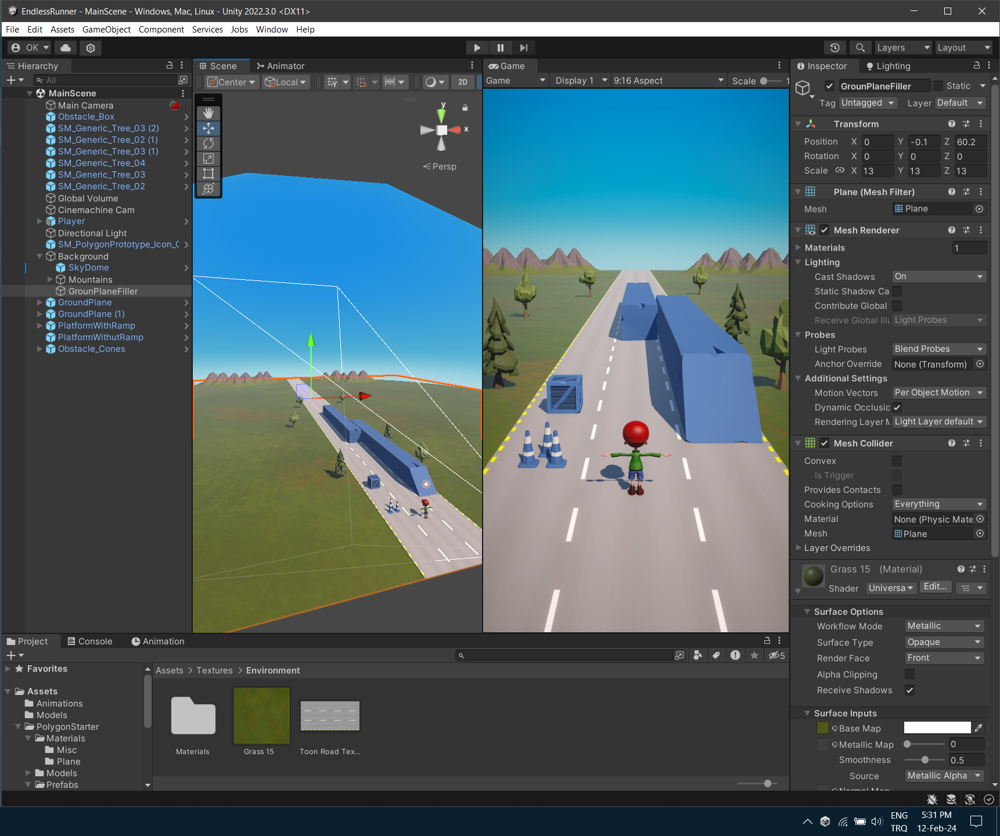
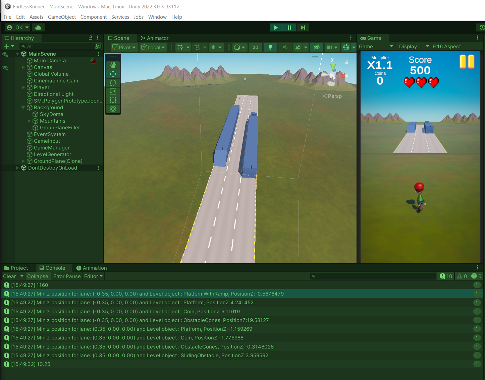

# VeloGames Unity - Endless Runner With Precedural Level Generation and Object Pooling

Made with Unity 2022.3.0f1 LTS 

----------
<!-- TABLE OF SECTIONS -->
  # Sections
  <ol>
	  <li><a href="#Introduction">Introduction</a></li>
	  <li><a href="#Dev Log">Dev Log</a></li>
	  <li><a href="#Videos">Videos</a></li>
	  <li><a href="#Technical Details">Technical Details</a></li>
	  <li><a href="#Acknowledgements">Acknowledgements</a></li>
  </ol>

----------

<!-- INTRODUCTION -->
## Introduction

A task project assigned by Velo Games.

A simple endless runner game similar to subway surfers. With precedural level generation.

More info in VeloGames-task-2-tr.pdf in the root folder.

Zip for 24th of February PC Built can be found in GameBuilds folder. WASD for controls.

----------

<!-- Dev Log -->
## Dev Log

I decided to move the player using transform.position to achieve a more consistent movement feeling.

The player does not move in the Z direction to keep everything close to the origin point, which helps avoid floating point errors for endless runs. This approach prevents transforms from becoming exponentially larger as time progresses.

Using RigidBody resulted in somewhat "ragdoll-like" movements that felt draggy. 

This was my first attempt at implementing object pooling and procedural level generation. (HUGE GAINS!)

I spent most of my time figuring out how to utilize them effectively. Due to venturing into "unknown" territories, during the first two weeks, my time to polish anything was limited. I feel like almost every aspect of the game is unpolished.

Overall, I'm pleased with how the project turned out. I'm happy that I was able to create somewhat playable "generated" levels.
 
# Day 0 - Scene Adjustments

 

# Day 5: - First attempt at procedural level generation.

 

## Known Bugs to adress for the 28.02.2024 - Final Commit: 

1) Object Pooling is not fully adapted. Once the initially instantiated pool is "consumed", the objects that are enqueued from the ReturnToPool() method cause a bug. This issue results in the level generator delaying its functions, causing significant gaps between ground planes. 
Additionally, the procedural logic fails at that point, as multiple GameObjects tend to spawn on the same segment simultaneously.

2) Occasionally, the level generator creates a structure with no route for the player to move across, represented as:

```
oxo

xox 
```

or

```
xox

oxo 
```

o = empty space, x = platform without ramp
 
I attempted to address this in the EnsureGroundPassable() method as follows:

```csharp
 if (j == 1 && _mapData[j, i].Type == SegmentType.Platform)
                    {
                        if(!IsCrossNeighborSegmentEmpty(j, i, -1,-1) && !IsCrossNeighborSegmentEmpty(j, i, 1, -1))
                        {
                            int randomDirection = UnityEngine.Random.Range(0, 2) == 0 ? -1 : 1;
                            _mapData[j+ randomDirection, i].Type = SegmentType.Empty;
                        }

                    }
```

However, this did not completely solve the issue. The algorithm does not address problems between ground planes; it only resolves issues within segments assigned to a single ground plane. In the limited time I've spent debugging, I noticed this pattern more than once within a ground plane.

----------

<!-- Videos -->
## Videos

16.02.2024 - Working in editor: 

Main functions complete, buggy and "game feel" is bad. 

[](https://youtu.be/NwwSOqZ5ZHA)

25.02.2024 - Working PC build:

Precedural Level generation + Object Pooling added (plus more bugs with): 

W,A,S,D to play, I know it's not optimum but its not finalized.

[](https://youtu.be/1D3a1zeO6hc)

----------

<!-- Technical Details -->
## Technical Details

-Procedural Level Generation - LevelGenerator.cs 

-Object pooling - PoolItem, ObjectPoolManager.cs

-Observer pattern - how main mechanics work, even player controller works with observer

----------

<!-- Acknowledgements -->
## Acknowledgements

A non profit project. 


## In Game Assets:

POLYGON Starter Pack - Low Poly 3D Art by Synty https://assetstore.unity.com/packages/essentials/tutorial-projects/polygon-starter-pack-low-poly-3d-art-by-synty-156819

Mixamo - Timmy (main character) & animations - Adobe - https://www.mixamo.com/#/ 

Toon Road Texture - https://opengameart.org/content/toon-road-texture

Grass texture - Grass 15 - https://opengameart.org/content/blended-textures-of-dirt-and-grass


## Sounds Assets: Unused

select sound - https://pixabay.com/sound-effects/select-sound-121244/


## UI Assets: 

heart pixel art - https://opengameart.org/content/heart-pixel-art

UI - Cartoon Mobile Rounded Icon Buttons - NathanLovatoArt - https://opengameart.org/content/cartoon-mobile-rounded-icon-buttons

